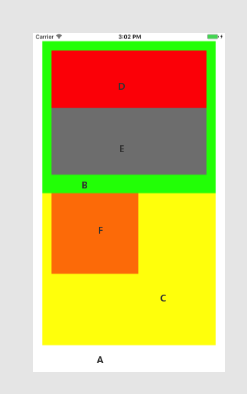
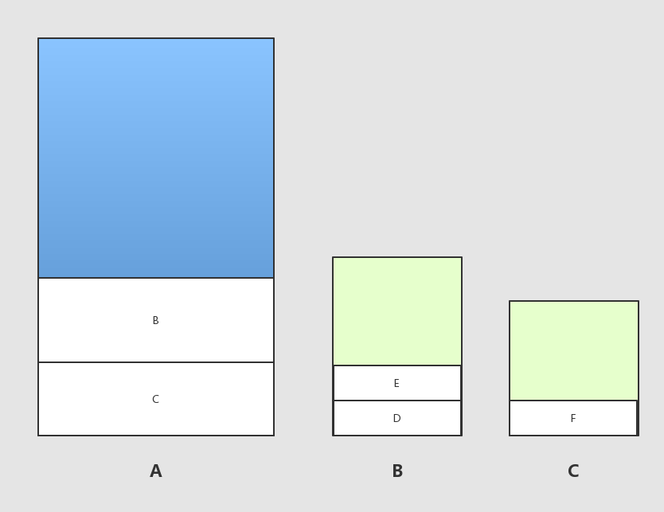

默认大家都大概了解了hit-test view和响应者链，这里就不啰嗦了，只是简单回顾一下。

---

1.在触摸交互时，系统需要首先找到响应者，__hit-test__就是来找触碰点所在视图（Initial view）的：

touch ———→  UIApplication ———→  UIWindow ———→ Root View ———→ . . . ———→subview

需要__注意__的是，如果子视图的hidden = yes ，userInteractionEnabled = NO或alpha小于0.1都会令hitTest:withEvent返回nil。

2.有时候，hit-test找到的视图（Initial view）并不能处理这个touch，这是就需要通过__响应者链__找到可以处理的__响应者对象__，过程与hit-test相反。

* 如果touch所在视图有viewController，则交给controller
* 否则，沿着链找，如果到UIApplication都无法处理，则抛弃这个Touch事件。

__响应者对象：__有响应和处理事件能力的对象；具体来说就是继承__UIResponder__类的对象，eg：UIApplication、UIViewController、UIView等。

---

好吧，现在终于可以开始正题了。

先说我要讲什么，学习这个的时候我遇到了这几个问题：

1. 采用何种方式遍历子view的

2. 如何知道touch被转化为UIEvent了的（或者怎么转换的）

3. UIApplication如何分发UIEvent

4. 既然view都有hitTest方法，那么viewController如何感知（这个有点蠢，感知这个词也是）

   解释一下下图：A add C and B , B add D and E, C add F（顺序很重要）

答：

1. 之所以会问自己这个问题，想当然地把view画成树形结构了，揣测着他的遍历，钻到胡同里了。直到看到addSubview，马蛋！这不就是个栈吗！所以还是先进后出（入栈顺序很重要）。

   栈图：

   

   __点D块：__

   ~~~
   2017-07-05 15:25:06.359 HitTest_touchEvent[23818:2840795] point in
   2017-07-05 15:25:06.360 HitTest_touchEvent[23818:2840795] B:RFGBSubView
   2017-07-05 15:25:06.360 HitTest_touchEvent[23818:2840795] point not in
   2017-07-05 15:25:06.360 HitTest_touchEvent[23818:2840795] E:RFGEView
   2017-07-05 15:25:06.360 HitTest_touchEvent[23818:2840795] point  in
   2017-07-05 15:25:06.360 HitTest_touchEvent[23818:2840795] D:RFGDView
   2017-07-05 15:25:06.360 HitTest_touchEvent[23818:2840795] point in
   2017-07-05 15:25:06.361 HitTest_touchEvent[23818:2840795] B:RFGBSubView
   2017-07-05 15:25:06.361 HitTest_touchEvent[23818:2840795] point not in
   2017-07-05 15:25:06.361 HitTest_touchEvent[23818:2840795] E:RFGEView
   2017-07-05 15:25:06.361 HitTest_touchEvent[23818:2840795] point  in
   2017-07-05 15:25:06.361 HitTest_touchEvent[23818:2840795] D:RFGDView
   2017-07-05 15:25:06.362 HitTest_touchEvent[23818:2840795] -[RFGDView touchesBegan:withEvent:]
   2017-07-05 15:25:06.376 HitTest_touchEvent[23818:2840795] -[RFGDView touchesEnded:withEvent:]
   ~~~

   顺序：B ——>  E — > D 

   __点击F块__:

   ~~~
   2017-07-05 15:49:31.325 HitTest_touchEvent[23818:2840795] point not in
   2017-07-05 15:49:31.326 HitTest_touchEvent[23818:2840795] B:RFGBSubView
   2017-07-05 15:49:31.326 HitTest_touchEvent[23818:2840795] point  in
   2017-07-05 15:49:31.326 HitTest_touchEvent[23818:2840795] C:RFGCSubview
   2017-07-05 15:49:31.326 HitTest_touchEvent[23818:2840795] point  in
   2017-07-05 15:49:31.326 HitTest_touchEvent[23818:2840795] F:RFGFView
   2017-07-05 15:49:31.327 HitTest_touchEvent[23818:2840795] point not in
   2017-07-05 15:49:31.327 HitTest_touchEvent[23818:2840795] B:RFGBSubView
   2017-07-05 15:49:31.327 HitTest_touchEvent[23818:2840795] point  in
   2017-07-05 15:49:31.327 HitTest_touchEvent[23818:2840795] C:RFGCSubview
   2017-07-05 15:49:31.327 HitTest_touchEvent[23818:2840795] point  in
   2017-07-05 15:49:31.327 HitTest_touchEvent[23818:2840795] F:RFGFView
   2017-07-05 15:49:31.328 HitTest_touchEvent[23818:2840795] F:-[RFGFView touchesBegan:withEvent:]
   2017-07-05 15:49:31.344 HitTest_touchEvent[23818:2840795] F:-[RFGFView touchesEnded:withEvent:]
   ~~~

   顺序：B ——>  C ———> F 

   到这里有同学会问，额，并不会问。这里插个题外的，view的touch系列方法（touchesEnded，touchesBegan等），如果子view不实现，会一直传到rootView，本例即我们的viewController（相当于响应者链）。

   __这里真正的问题是__hittest为什么要执行两遍，查了资料无果，这里猜测一下，也罢！瞎比猜的就不写了！希望有知道的同学解答一下，专业的解答一下!

2. 当手指触摸屏幕时，会产生UITouch和UIEvent（先后），UITouch和点击事件一一对应。

3. UITouch和UIEvent两个对象会被传递到UIApplication管理的一个事件队列中，UIApplication会取出最前的事件（先后），将事件传递到UIWindow。窗口再在视图层找合适的视图来处理。

4. 说蠢是因为hittest是view的方法，ViewController是控制器没有该方法的声明。